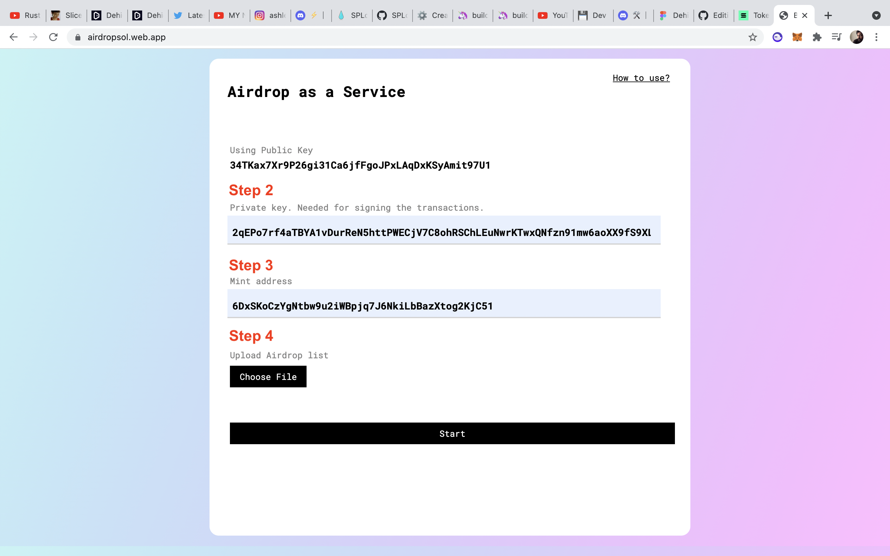

# airdrop-as-a-service
Solution for the superteamDAO bounty by Solrazr
https://superteam.fun/500-bounties/airdrop-as-a-service-dev-bounty

## How to test

#### Mint a token 

1. Install `solana cli` and `spl-token cli`
2. Set solana config to devnet using `solana config set --devnet`
3. Generate a user using `solana keygen` command. This sets the default user for the cli
4. Mint and supply a token using `spl-token` as mentioned here https://spl.solana.com/token

#### Import this user into Phantom wallet

1. Use this command `cat /Users/USERNAME/.config/solana/id.json` to print out the private key
2. Encode the array to a string using base 58
3. Open Phantom -> Add/Connect Wallet -> Import Private Key -> Paste the string

#### Run the web app

1. Clone the repo and run `npm install` and `npm start`

## How to Use

If you have already minted a token and would now like to airdrop them, visit https://airdropsol.web.app/

PS: If you're checking it out, you need to allow insecure content in site settings, otherwise connection to devnet isn't happening. Firebase hosting doesn't allow http calls.

Watch this video for an easy overview
https://drive.google.com/file/d/1EH-4t4xdpvcYWctfV1TDl3fHL5L5-Mgo/view?usp=sharing

1. Connect to Phatom wallet using the connect to wallet button. This provides the app access to the public address
2. You also need to provide the private key to sign the transcations and to pay for account creation if the destination address doesn't have an associated token account
3. Upload a file containing destination public keys and corresponding amount in the least denomination (i.e no decimal point). Also csv file shouldn't contain any headings
4. Press start to begin the transactions. The app does the transactions one by one and waits for the first one to be verified before sending the next one.
5. If any of the transactions fail, it skips and proceeds with the next one.
6. On completion you get a downloadable csv report with the signature and verification status of the signature for each transaction

